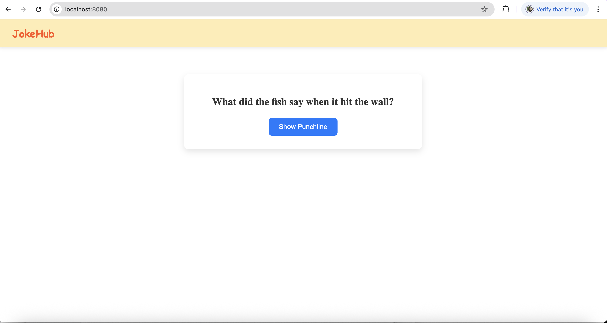
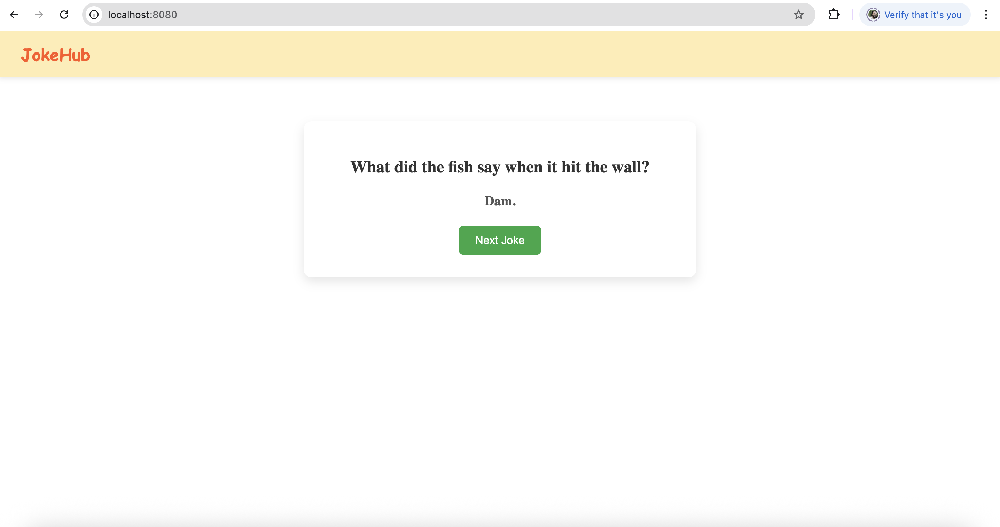
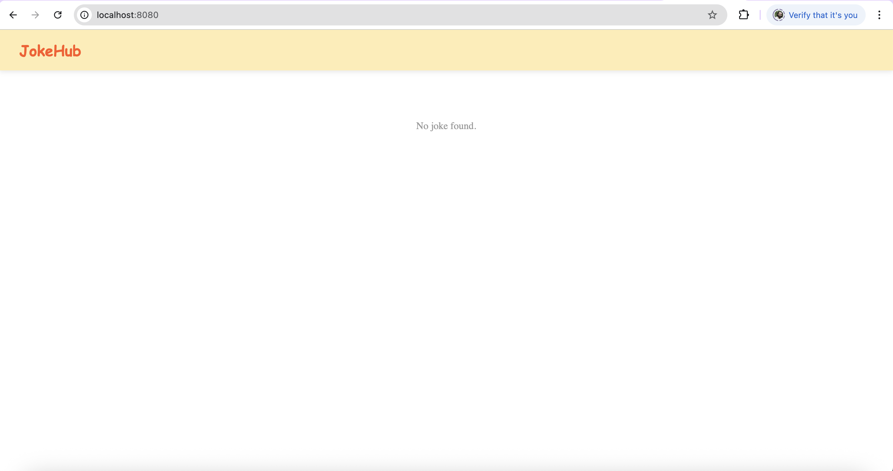

# JokeHub
Jokehub is a fun app, which displays joke and it's punchline. This is a full stack application build using Spring Boot 3.5.0 and Angular 20. Front-end and Backend Applications has been created separately and finally copied the compiled prod version of angular app to Spring boot's static folder, so that it can be deployed as a single unit. When the application starts up all the data in resources/jokes.json will be loaded to H2 in-memory database.

# Prerequisites
* Java 17+
* Node (22.12.0) and npm (10.9.0)
* Angular CLI 20.0.1
* Docker 27.4.0

# Building the application
Build process has below segregation
## Building Frondend(Angular) App
1. Navigate to the Angular frontend/jokes-ui folder and install the dependencies
```bash
cd frontend/jokes-ui
npm install
```
2. Build the angular app in production mode
```bash
ng build --configuration=production
```
3. This will create static files in /frontend/jokes-ui/dist folder which need to be copied to Spring boot app.
```bash
cp -r /frontend/jokes-ui/dist/jokes-ui/browser/* ../backend/src/main/resources/static/
```
## Building Backend(Spring Boot) App
4. Navigate to the backend directory and build the Spring Boot app with Maven
```bash
cd backend
./mvnw clean package
```
This will generate executable jar (jokehub-0.0.1-SNAPSHOT.jar) file in /target folder
# Running Unit tests
To run the backend unit tests for service and controller layers:
```bash
./mvnw test
```
# Running the application locally
Run the Spring Boot jar:
```bash
java -jar target/jokehub-0.0.1-SNAPSHOT.jar
```
The appliaction will be available on http://localhost:8080 . Rest API can be tested using Postman.
API URL are : 
* http://localhost:8080/api/v1/jokes/count
* http://localhost:8080/api/v1/jokes/{id}

# Data in H2 DB
When the app starts up, all the data from resources/jokes.json will be loaded to H2 in-memory database. This can be viewed using the h2 console - http://localhost:8080/h2-console.
Properties are: 
```
spring.datasource.url=jdbc:h2:mem:jokesdb
spring.datasource.driverClassName=org.h2.Driver
spring.datasource.username=sa
spring.datasource.password=
```
# Dockerization
From the project root where the Dockerfile is located, run the follwoing commands
```bash
docker build -t jokehub:latest .
docker run -p 8080:8080 jokehub
```
# Screenshots




